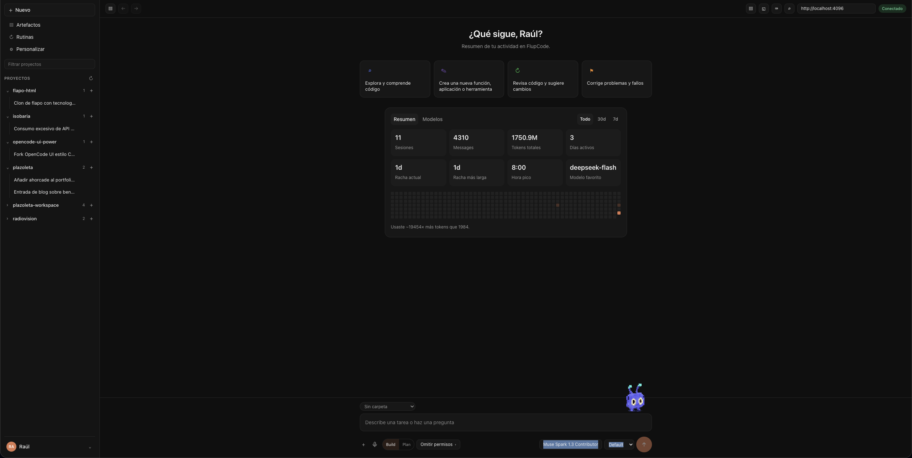

# FlupCode

**A Claude Code–style web & desktop harness for OpenCode.**

<p align="center">
  <a href="https://github.com/rldona/FlupCode/actions/workflows/harness.yml"></a>
  <a href="https://github.com/rldona/FlupCode/releases"></a>
  <a href="https://github.com/rldona/FlupCode/blob/power/LICENSE"></a>
  <a href="https://flupcode.com"></a>
</p>

<p align="center">
  
  <a href="https://github.com/rldona/FlupCode/stargazers"></a>
  <a href="https://github.com/rldona/FlupCode/issues"></a>
  
  
</p>

<p align="center">
  
</p>

🌐 **Website:** [flupcode.com](https://flupcode.com) · 💻 **Source:** [rldona/FlupCode](https://github.com/rldona/FlupCode) · ⬇️ **[Download](https://github.com/rldona/FlupCode/releases/latest)**

FlupCode is a fork of [OpenCode](https://github.com/anomalyco/opencode) that takes its
terminal-grade feature set and packages it into a first-class **web and desktop experience**:
a harness layout with a project sidebar, usage dashboard, artifacts, routines and a polished
composer — modelled on the Anthropic Claude Code desktop app.

> **Not affiliated with OpenCode or Anthropic.** FlupCode is an independent fork. "OpenCode"
> is the upstream project by [Anomaly](https://anoma.ly), and "Claude Code" is a product of
> Anthropic. This fork is not built by, endorsed by, or affiliated with either of them.

## Why a fork

OpenCode is already a client/server system: `opencode serve` exposes an HTTP + SSE API and every
front-end (terminal TUI, web app, desktop app, IDE plugins) is just a client. FlupCode reuses
that engine untouched and focuses entirely on the **experience layer** — the shell, the design
system and the harness features that OpenCode's default UI does not emphasise.

## Highlights

- **Engine untouched.** All OpenCode packages stay pristine so upstream changes can be pulled in.
- **Isolated product code.** Everything we build lives in `packages/harness` (web) and
  `packages/harness-desktop` (desktop), reusing `@opencode-ai/ui`, `@opencode-ai/session-ui`
  and the generated client/SDK.
- **Upstream-first.** `dev` is a fast-forward mirror of `anomalyco/opencode`; our work lives on
  `power`. See [docs/UPSTREAM.md](docs/UPSTREAM.md).
- **Full TUI parity.** Feature-for-feature mapping of the terminal UI to the web UI is tracked in
  [docs/PARITY.md](docs/PARITY.md).
- **Harness features.** Usage dashboard, activity heatmap, multi-project workspaces, pinned
  items, artifacts and routines — see [docs/ROADMAP.md](docs/ROADMAP.md).

## Status

**v1.0.** The web harness (Claude Code–style shell, TUI parity, dashboard, artifacts, routines,
i18n) and the Electron desktop app are built; the upstream sync and release pipelines are in place.
See [docs/ROADMAP.md](docs/ROADMAP.md) for the live status.

## Repository layout

```
packages/harness              # FlupCode web app (SolidJS + Vite) — our product code
packages/harness-desktop      # Electron desktop wrapper (later phase)
packages/app                  # upstream OpenCode web app (pristine, reused for parts)
packages/tui                  # upstream terminal UI (pristine)
packages/ui                   # upstream shared UI primitives (reused)
packages/session-ui           # upstream session/message rendering (reused)
packages/core | server | sdk  # upstream engine (pristine)
docs/                         # project documentation (this fork)
```

## Development

Requirements: [Bun](https://bun.sh) 1.3+.

```bash
bun install
bun run dev:harness      # start the FlupCode web app
bun run dev:web          # start the upstream web app (reference)
bun run dev:desktop      # start the upstream desktop app (reference)
```

> **Corporate registry note.** If your global `~/.npmrc` points at a private registry, force the
> public registry for installs:
> `npm_config_registry="https://registry.npmjs.org/" bun install --frozen-lockfile`

## Documentation

| Document | Purpose |
| --- | --- |
| [docs/ARCHITECTURE.md](docs/ARCHITECTURE.md) | How the monorepo fits together and where FlupCode lives |
| [docs/USAGE.md](docs/USAGE.md) | Install, run, keyboard shortcuts and troubleshooting |
| [docs/UPSTREAM.md](docs/UPSTREAM.md) | Branch model, syncing with `anomalyco/opencode` |
| [docs/DESIGN.md](docs/DESIGN.md) | Design system and the Claude Code–style harness direction |
| [docs/PARITY.md](docs/PARITY.md) | TUI ↔ Web feature parity matrix |
| [docs/ROADMAP.md](docs/ROADMAP.md) | Prioritised, ticket-based roadmap |
| [docs/RELEASE.md](docs/RELEASE.md) | Versioning and release process |
| [docs/CONTRIBUTING.md](docs/CONTRIBUTING.md) | Language, conventions, workflow |
| [docs/adr/](docs/adr/) | Architecture Decision Records |
| [docs/tickets/](docs/tickets/) | Per-phase ticket breakdowns |

## License

MIT, inherited from OpenCode. See [LICENSE](LICENSE). Upstream copyright and attribution are
preserved.
