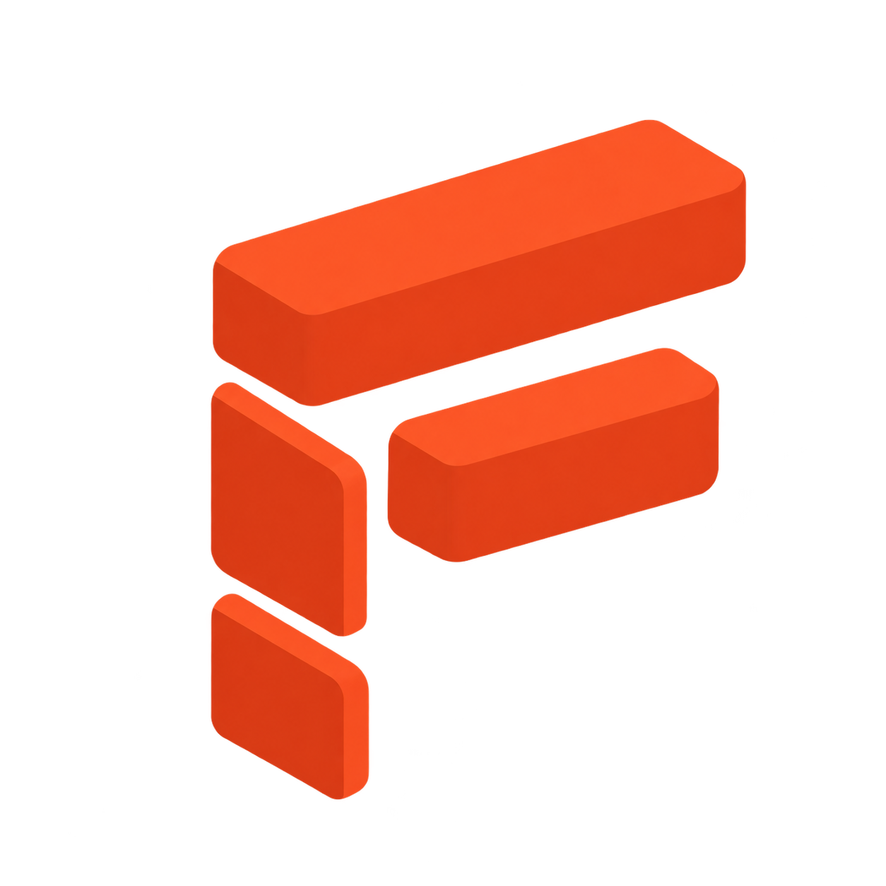
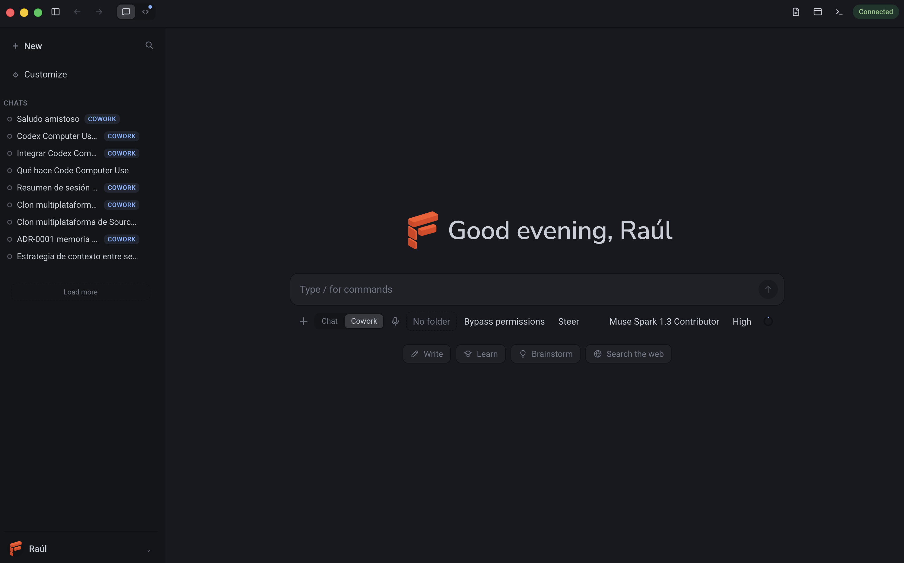

<p align="center">
  <a href="https://flupcode.com"></a>
</p>

<p align="center">
  
</p>

<p align="center">
  <a href="https://github.com/rldona/FlupCode/actions/workflows/harness.yml"></a>
  <a href="https://github.com/rldona/FlupCode/releases"></a>
  <a href="https://github.com/rldona/FlupCode/blob/power/LICENSE"></a>
  <a href="https://flupcode.com"></a>
</p>

<p align="center">
  
  <a href="https://github.com/rldona/FlupCode/stargazers"></a>
  <a href="https://github.com/rldona/FlupCode/issues"></a>
  
  
</p>

---

### Contents

- [Why a fork](#why-a-fork)
- [Highlights](#highlights)
- [Status](#status)
- [Repository layout](#repository-layout)
- [Install](#install)
- [Development](#development)
- [Web app](#web-app)
- [Documentation](#documentation)
- [License](#license)

🌐 **Website:** [flupcode.com](https://flupcode.com) · 🖥️ **Web app:** [app.flupcode.com](https://app.flupcode.com) · 💻 **Source:** [rldona/FlupCode](https://github.com/rldona/FlupCode) · ⬇️ **[Download](https://github.com/rldona/FlupCode/releases/latest)**

FlupCode is a fork of [OpenCode](https://github.com/anomalyco/opencode) that takes its
terminal-grade feature set and packages it into a first-class **web and desktop experience**:
a harness layout with a project sidebar, usage dashboard, runs, workflows, artifacts, routines and a
polished composer — modelled on the Anthropic Claude Code desktop app.

> **Requires the OpenCode engine.** FlupCode is a client and does not bundle it: install the
> [OpenCode CLI](https://opencode.ai/docs/) and the app connects to it. Without an engine reachable,
> the desktop app, the hosted web app and `flupcode remote` cannot run.

> **Not affiliated with OpenCode or Anthropic.** FlupCode is an independent fork. "OpenCode"
> is the upstream project by [Anomaly](https://anoma.ly), and "Claude Code" is a product of
> Anthropic. This fork is not built by, endorsed by, or affiliated with either of them.

## Why a fork

OpenCode is already a client/server system: `opencode serve` exposes an HTTP + SSE API and every
front-end (terminal TUI, web app, desktop app, IDE plugins) is just a client. FlupCode reuses
that engine untouched and focuses entirely on the **experience layer** — the shell, the design
system and the harness features that OpenCode's default UI does not emphasise.

## Highlights

- **Engine untouched.** All OpenCode packages stay pristine so upstream changes can be pulled in.
- **Isolated product code.** Everything we build lives in `packages/harness` (web) and
  `packages/harness-desktop` (desktop), reusing `@opencode-ai/ui`, `@opencode-ai/session-ui`
  and the generated client/SDK.
- **Upstream-first.** `dev` is a fast-forward mirror of `anomalyco/opencode`; our work lives on
  `power`. See [docs/UPSTREAM.md](docs/UPSTREAM.md).
- **Full TUI parity.** Feature-for-feature mapping of the terminal UI to the web UI is tracked in
  [docs/PARITY.md](docs/PARITY.md).
- **Harness features.** Usage dashboard, activity heatmap, multi-project workspaces, pinned
  items, artifacts and routines — see [docs/ROADMAP.md](docs/ROADMAP.md).
- **Runs that outlive the window.** A harness server of its own keeps runs, tasks, routines and
  artifacts: workflows written down as editable files and launched with `/feature …`, checks the
  harness runs itself with the evidence kept, bounded retries when one fails, and human gates that
  hold a run until you let it through — see [docs/USAGE.md](docs/USAGE.md#runs).
- **Remote control.** Drive your computer's sessions from your phone on any network, like Claude
  Code's remote control: pair with a QR code, follow and start sessions, answer permission requests.
  Traffic is end-to-end encrypted through a relay that cannot read it. Host it from the desktop app
  or from a terminal with `flupcode remote` — see [docs/USAGE.md](docs/USAGE.md#remote-control) and
  [ADR-0010](docs/adr/0010-remote-control-relay.md).

## Status

**v1.15.0.** The web harness (Claude Code–style shell, TUI parity, dashboard, i18n), the Electron
desktop app and remote control (relay at `relay.flupcode.com`, phone view, `flupcode remote`) are
released, along with the harness server that owns runs: tasks, routines with history, verification
with evidence, workflows with human gates, and artifacts — now including the **documents the agent
generates** (kept in `.flupcode/artifacts` with the `artifact_write` tool, listed under Artifacts and
read by type: markdown, HTML, image, PDF). Editors for routines, agents and skills open in dialogs,
and Compare runs inside the chat layout. The upstream sync and release pipelines are in place.
Desktop builds are not yet signed by Apple or Microsoft (see [Install](#install)). See
[docs/ROADMAP.md](docs/ROADMAP.md) for the live status.

## Repository layout

```
packages/harness              # FlupCode web app (SolidJS + Vite) — our product code
packages/harness-desktop      # Electron desktop app (also hosts remote control)
packages/remote               # remote control protocol and host (shared by desktop, CLI, web)
packages/relay                # remote control relay server (Bun, deployed on Fly.io)
packages/flupcode-cli         # the `flupcode` command (`flupcode remote`)
packages/landing              # flupcode.com static site
packages/app                  # upstream OpenCode web app (pristine, reused for parts)
packages/tui                  # upstream terminal UI (pristine)
packages/ui                   # upstream shared UI primitives (reused)
packages/session-ui           # upstream session/message rendering (reused)
packages/core | server | sdk  # upstream engine (pristine)
docs/                         # project documentation (this fork)
```

## Install

> **Install the engine first.** FlupCode does not ship OpenCode. Get the
> [OpenCode CLI](https://opencode.ai/docs/) so the desktop app can start it for you, or run it
> yourself:
>
> ```bash
> opencode serve --port 4096                                  # desktop
> opencode serve --port 4096 --cors https://app.flupcode.com  # hosted web app
> ```

Download the desktop app and the `flupcode` CLI from the
[latest release](https://github.com/rldona/FlupCode/releases/latest):

| Platform | Desktop app | CLI |
| --- | --- | --- |
| macOS (Apple Silicon) | `FlupCode-mac-arm64.dmg` | `flupcode-darwin-arm64` |
| macOS (Intel) | `FlupCode-mac-x64.dmg` | `flupcode-darwin-x64` |
| Windows | `FlupCode-win-x64.exe` | `flupcode-windows-x64.exe` |
| Linux | `FlupCode-linux-x64.AppImage` | `flupcode-linux-x64`, `flupcode-linux-arm64` |

The builds are **not signed** yet, so macOS shows "FlupCode Not Opened" / "No se ha abierto
FlupCode" and Windows shows SmartScreen. On macOS, click **Done**, then open **System Settings →
Privacy & Security** and click **Open Anyway** — or run
`xattr -dr com.apple.quarantine /Applications/FlupCode.app`. Details in
[docs/USAGE.md](docs/USAGE.md#installing-a-release).

## Development

Requirements: [Bun](https://bun.sh) 1.3+.

```bash
bun install
bun run dev:harness      # start the FlupCode web app
bun run dev:web          # start the upstream web app (reference)
bun run dev:desktop      # start the upstream desktop app (reference)
```

> **Corporate registry note.** If your global `~/.npmrc` points at a private registry, force the
> public registry for installs:
> `npm_config_registry="https://registry.npmjs.org/" bun install --frozen-lockfile`

## Web app

Use the hosted UI at [app.flupcode.com](https://app.flupcode.com) — it connects to an engine on
your machine. First install the OpenCode CLI (see [opencode.ai/docs](https://opencode.ai/docs/) for
your platform), then start it with CORS enabled for the hosted origin:

```bash
opencode serve --port 4096 --cors https://app.flupcode.com
```

`--cors` is required because the page and the engine are different origins; the app connects to
`http://localhost:4096` by default (change it in **Settings → Server**).

> The published OpenCode CLI tracks upstream and does **not** include FlupCode's core patches
> (GitHub Copilot OAuth in the v2 catalog, session permission modes). To get those, run the engine
> from this fork's source instead:
>
> ```bash
> bun install
> OPENCODE_DISABLE_CHANNEL_DB=1 bun run --cwd packages/opencode src/index.ts serve \
>   --port 4096 --cors https://app.flupcode.com
> ```

## Documentation

| Document | Purpose |
| --- | --- |
| [docs/GETTING-STARTED.md](docs/GETTING-STARTED.md) | First run: install the engine per platform, start it and fix a blocked connection |
| [docs/ARCHITECTURE.md](docs/ARCHITECTURE.md) | How the monorepo fits together and where FlupCode lives |
| [docs/USAGE.md](docs/USAGE.md) | Install, run, keyboard shortcuts and troubleshooting |
| [docs/UPSTREAM.md](docs/UPSTREAM.md) | Branch model, syncing with `anomalyco/opencode` |
| [docs/DESIGN.md](docs/DESIGN.md) | Design system and the Claude Code–style harness direction |
| [docs/PARITY.md](docs/PARITY.md) | TUI ↔ Web feature parity matrix |
| [docs/ROADMAP.md](docs/ROADMAP.md) | Prioritised, ticket-based roadmap |
| [docs/COMMUNITY-FEATURES.md](docs/COMMUNITY-FEATURES.md) | Community-requested OpenCode features prioritised for FlupCode |
| [docs/RELEASE.md](docs/RELEASE.md) | Versioning and release process |
| [docs/CONTRIBUTING.md](docs/CONTRIBUTING.md) | Language, conventions, workflow |
| [docs/adr/](docs/adr/) | Architecture Decision Records |
| [docs/tickets/](docs/tickets/) | Per-phase ticket breakdowns |

## License

MIT, inherited from OpenCode. See [LICENSE](LICENSE). Upstream copyright and attribution are
preserved.
